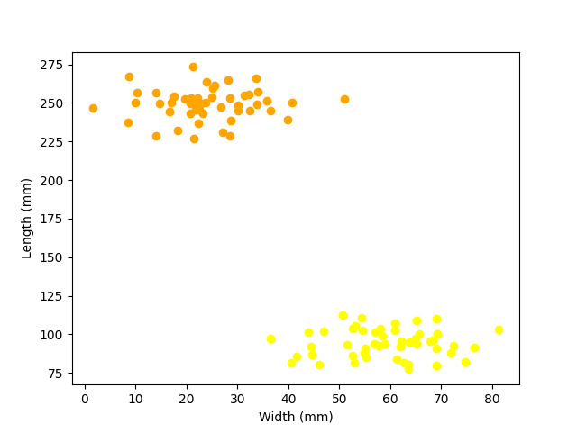

# Bachelor Thesis Simulations
This repository contains the project files written by me that I used to perform the simulations for my bachelor thesis "*Initialization of the k-means algorithm - A comparison of three methods*". The thesis was evaluated and approved in January of 2023 and is available through the Mathematical Institution at Stockholm University, and also [here](Documentation/Thesis_final_version.pdf) in this repository.

## Summary of thesis
The topic of my thesis may seem complicated and hard to grasp, so here comes a simple explanation. There is an algorithm called the *k-means algorithm*. The intended purpose of it is to find *groups* of datapoints, like in the image below which shows length and width measurements of potatoes and carrots respectively. The way that the algorithm works is it starts with a (usually) really bad guess of what points belong to which group. Then it refines the guess over and over again until it finally is good enough. The really bad guess at the start can be done in many different ways. In my thesis, I compare three different ways to do the bad guess, and try to figure out which one is the best/cheapest.

If you are a bit more interested, here is the abstract:

"*k-means is a simple and flexible clustering algorithm that has remained in common use for 50+
years. In this thesis, we discuss the algorithm in general, its advantages, weaknesses and how its ability
to locate clusters can be enhanced with a suitable initialization method. We formulate appropriate
requirements for the (batched) UnifRandom, k-means++ and Kaufman initialization methods and
compare their performance on real and generated data through simulations. We find that all three
methods (followed by the k-means procedure) are able to accurately locate at least up to nine well-separated clusters, but the appropriately batched UnifRandom and the Kaufman methods are both
significantly more computationally expensive than the k-means++ method already for K = 5 clusters
in a dataset of N = 1000 points*"

## Structure of files
The file structure will be described later.